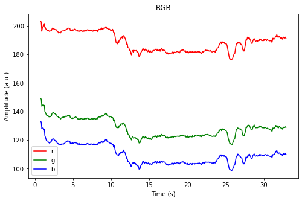
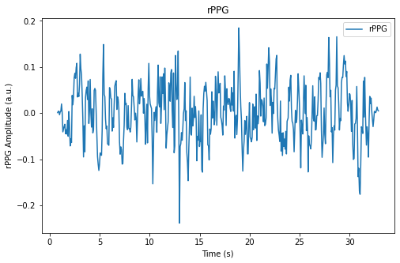

# cvpm
Computer Vision for Physiological Measurement

## Heart Rate Monitoring

Run the command in terminal `python cvhr.py`

The video and rppg signal will be saved in the `rppg` folder. In case you don't want to save the video and rppg signal, set the `save_rppg = False`

Below is a short video demo:

Below is the plot of the RGB channel signal and the rPPG signal:

TO-DO-List:
- update readme
- add gui to show realtime rPPG signal